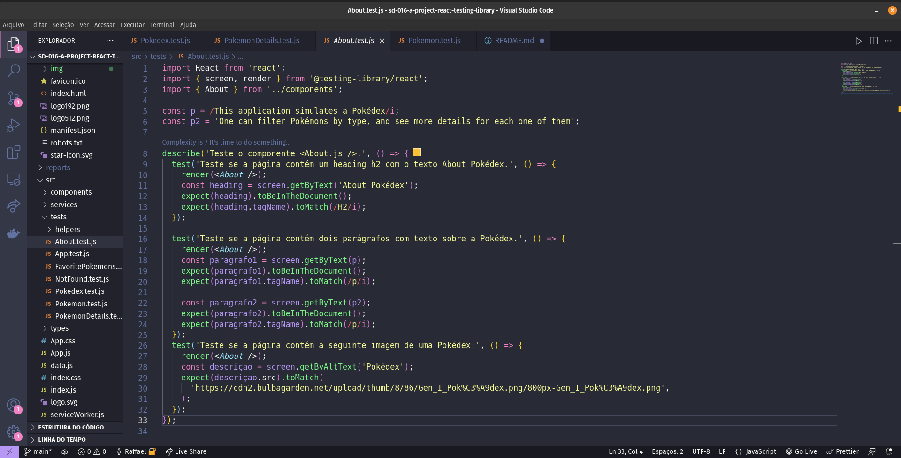

# Projeto react testing library

## [Clique aqui](https://react-testing-library.vercel.app/) para acessar o App

## Descrição
este site é uma amostra de como posso testar cada componente, impedindo que os usuarios possam ter conflito com qualquer funcionalidade desse site.

## observaçao
o site em questao foi feito por instrutores, toda componentizaçao, estilo, e logica. A minha parte foi testar cada componente e possivel erro ultilizando a biblioteca react-testing-library  .

## Habilidades

Neste projeto, mostro que sou capaz de:

* Utilizar os seletores (queries) da React-Testing-Library em testes automatizados.

* Simular eventos com a React-Testing-Library em testes automatizados.

* Testar fluxos lógicos assíncronos com a React-Testing-Library.

* Escrever testes que permitam a refatoração da estrutura dos componentes da aplicação sem necessidade de serem alterados.

* Criar mocks de APIs utilizando fetch.

* Testar inputs.

## Tecnologias Utilizadas:
|HTML|CSS|JavaScript|ReactJS|react-testing-library|
|-|-|-|-|-|
||||||
|Sintaxe JSX|Utilizado na estilização das páginas e dos componentes com styled components|Aplicação das funcionalidades com o Framework React|Recursos Utilizados: Function Components, React Router DOM, React Hooks|fornece funções utilitárias leves em cima de react-dome react-dom/test-utils. 
___

